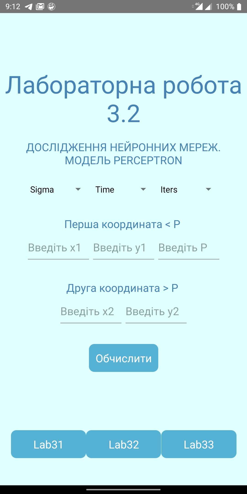

Лабораторні роботи(3.1-3.3) з курсу систем реального часу  
Варіант - 24  

Результат виконнання лаб. робот можно перевірити 2ма шляхами:  

1. завантажити та встановити на андроид-пристрій апк (/apk/rts-3.apk)
2. Зклонити репу(повинен бути встановлений yarn та react-native) && перейти до кореню директорії && yarn install && yarn start && yarn android   запуститься емулятор

Щодо 3.1 (ФАКТОРИЗАЦІЯ ЧИСЛА) 
алгоритм знаходиться у an_korr_rts3/src/utils/fermats/factorization.js -> factorizationFermats 
скріни роботи: 
</img>
</img>
</img>

Щодо 3.2 (ДОСЛІДЖЕННЯ НЕЙРОННИХ МЕРЕЖ) 
алгоритм знаходиться у an_korr_rts3/src/utils/perceptron/perceptron.js -> calcPerceptron 
скріни роботи: 
</img>
</img>
</img>

Щодо 3.3 (ДОСЛІДЖЕННЯ ГЕНЕТИЧНОГО АЛГОРИТМУ) 
алгоритм знаходиться у an_korr_rts3/src/utils/genetic/genetic.js -> calcGenetic 
скріни роботи: 
</img>
</img>
</img>
